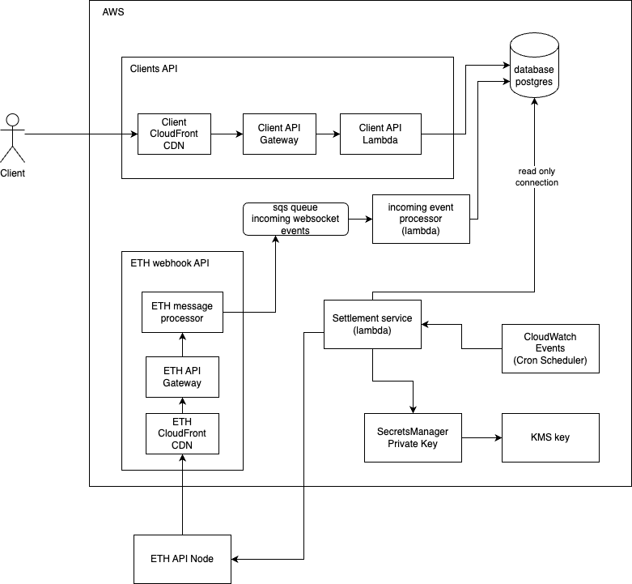

# Degen Markets

This repo contains the entire infrastructure for the degen markets project.

## Architecture



### Endpoints

The Architecture provides 2 public endpoints

* ClientApi
  * Used for clients to interact with the platform
* WebhookApi
  * Used to handle webhooks from Alchemy when blockchain events are emitted

### Data storage

The System has a postgres database that stores all data

## Usage

### Setup

1) Copy the `.env.example` file to a `.env` file
2) Create a degen-markets AWS profile in `~/.aws/config`
```
[profile degen-markets]
region = eu-west-1
output = json
cli_pager =
```
3) Add credentials for the profile with `aws configure --profile degen-markets`

### Commands

* `make deploy`
  * deploys the entire backend to AWS
* `make lint`
  * checks linting
* `make lint_fix`
  * fixes linting
* `make diff`
  * checks which resources changed
* `make bootstrap`
  * bootstraps the AWS account (only needs to be done once)
* `make trigger_db_migration`
  * triggers the database migration
* `make tunnel`
  * starts a tunnel to the database in AWS on port 5541
  * using connection string `jdbc:postgresql://localhost:5541/degenmarkets`
  * get password from secretsmanager secret `DatabaseCredentials`

## Testing

Example test which mocks an AWS service can be found in `src/clients/SecretClient.test.ts`