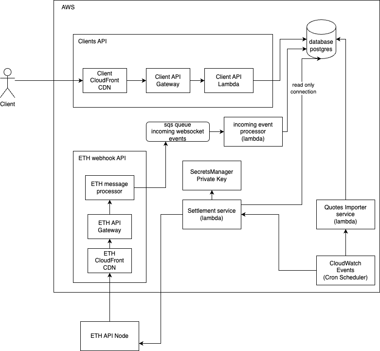

# Degen Markets

This repo contains the entire infrastructure for the degen markets project.

## Architecture



### Endpoints

The Architecture provides 2 public endpoints

- ClientApi
  - Used for clients to interact with the platform
- WebhookApi
  - Used to handle webhooks from Alchemy when blockchain events are emitted

### Data storage

The System has a postgres database that stores all data

## Usage

### Setup

1. Copy the `.env.example` file to a `.env` file
2. Create a degen-markets AWS profile in `~/.aws/config`

```
[profile degen-markets]
region = eu-west-1
output = json
cli_pager =
```

3. Add credentials for the profile with `aws configure --profile degen-markets`

### Commands

- `make deploy`
  - deploys the entire backend to AWS
- `make lint`
  - checks linting
- `make lint_fix`
  - fixes linting
- `make diff`
  - checks which resources changed
- `make bootstrap`
  - bootstraps the AWS account (only needs to be done once)
- `make trigger_db_migration`
  - triggers the database migration
- `make tunnel`
  - starts a tunnel to the database in AWS on port 5541
  - using connection string `jdbc:postgresql://localhost:5541/degenmarkets`
  - get password from secretsmanager secret `DatabaseCredentials`

### Scaling & Costs

- CDN is currently at PRICE_CLASS_100, which covers EU & NA but for Asia later, we will need to update this
- DB can be scaled by changing the instance size, this does not require a stack replacement
- Any new lambdas that need access to the DB have to be connected must have the db's vpc & added bundling, for e.g. see: `ClientApiLambda`

### Security

- PrivateKey
  - The role of user needs access to kms:Decrypto to be able to see the secret
  - We have to ensure that KMS key's rotation stays off

## Testing

Example test which mocks an AWS service can be found in `src/clients/SecretClient.test.ts`

### BE Changes:

-
- bet-withdrawn handler (should set bet `isPaid = true`)
- settler should have separate settle logic for each betType

### Blinks:

- Blink URL format: https://dial.to/?action=solana-action:https://actions.degenmarkets.com/pools/<POOL_ID>
